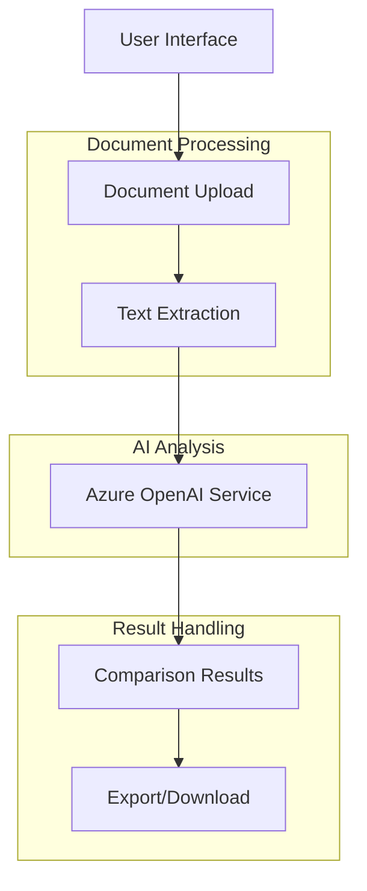

# Document Comparison Tool

This application allows you to compare two documents and identify key differences between them. It uses Azure OpenAI to perform intelligent document comparison.

## Features

- Upload and compare two documents (PDF, DOC, DOCX, TXT)
- Specify comparison criteria
- Identify additions, deletions, and modifications between documents
- Assess the importance of each change
- Export comparison results in multiple formats

## Application Architecture



## Environment Configuration

To use the Azure OpenAI integration, you need to set up environment variables:

1. Create a `.env` file in the root directory with the following variables:

```
# Azure OpenAI Configuration
AZURE_OPENAI_API_KEY=your_api_key_here
AZURE_OPENAI_ENDPOINT=your_endpoint_here
AZURE_OPENAI_DEPLOYMENT_NAME=your_deployment_name_here
AZURE_OPENAI_API_VERSION=your_api_version_here
AZURE_OPENAI_RESOURCE_NAME=your_resource_name_here
```

2. Replace the placeholder values with your actual Azure OpenAI credentials.

> **Note:** The `.env` file is excluded from version control for security reasons. Never commit your API keys to a public repository.

## Development Setup

1. Install dependencies:
```
npm install
```

2. Start the development server:
```
npm run dev
```

3. Build for production:
```
npm run build
```

## Technical Stack

- React with TypeScript
- Vite for build tooling
- Azure OpenAI for document comparison
- File handling with browser APIs
- Responsive design with Tailwind CSS

## License

This project is licensed under the MIT License - see the [LICENSE](LICENSE) file for details.

## Author

Created by Harshith Vaddiparthy

- Email: vharshith.2810@gmail.com
- GitHub: [harshith-eth](https://github.com/harshith-eth)
- Twitter: [@harshithio](https://twitter.com/harshithio) 