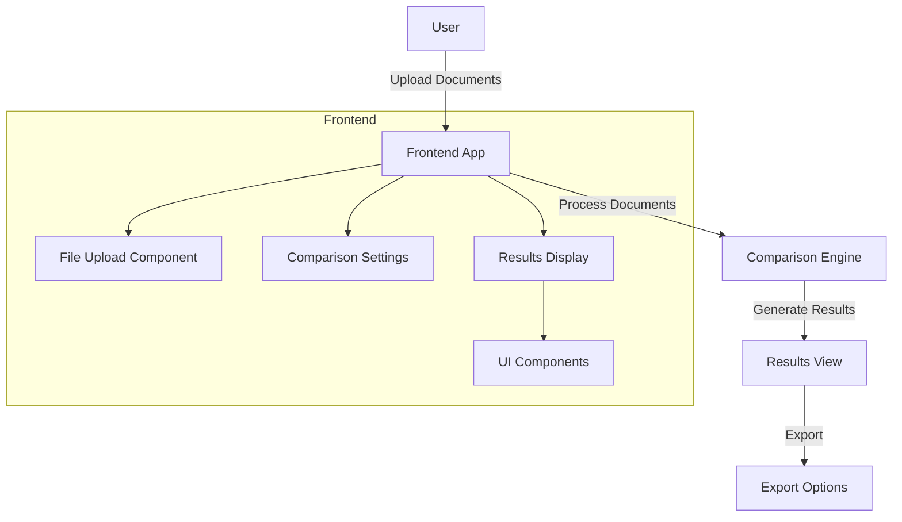

# Document Comparison Tool

This application allows users to upload and compare two documents, highlighting differences with varying importance levels for easy analysis.

## Architecture Overview



## Features

- **Document Upload**: Upload two documents for comparison
- **Side-by-Side Comparison**: View documents with synchronized scrolling
- **Highlighted Differences**: Visual highlighting of changes with importance levels
- **Export Options**: Save results in multiple formats
- **Responsive Design**: Works on desktop and mobile devices

## Tech Stack

- **React**: UI component library
- **TypeScript**: Type-safe JavaScript
- **Tailwind CSS**: Utility-first CSS framework
- **Vite**: Fast bundling and development
- **Radix UI**: Accessible UI primitives

## Getting Started

### Prerequisites

- Node.js (v18 or later)
- npm or yarn

### Installation

```bash
# Clone the repository
git clone https://github.com/harshith-eth/stackai-document-comparision.git

# Navigate to the project directory
cd stackai-document-comparision

# Install dependencies
npm install

# Start the development server
npm run dev
```

## Project Structure

```
document-comparision/
├── public/                  # Static assets
├── src/
│   ├── components/          # UI components
│   │   ├── ui/              # Base UI components
│   │   ├── Header.tsx       # Application header
│   │   ├── Button.tsx       # Custom button component
│   │   ├── ComparisonForm.tsx    # Document settings form
│   │   ├── ComparisonResults.tsx # Results display
│   │   └── FileUpload.tsx        # File upload handling
│   ├── types/               # TypeScript type definitions
│   ├── utils/               # Utility functions
│   ├── App.tsx              # Main application component
│   └── main.tsx             # Application entry point
├── package.json             # Project dependencies
└── tsconfig.json            # TypeScript configuration
```

## License

This project is licensed under the MIT License - see the [LICENSE](LICENSE) file for details.

## Author

Created by Harshith Vaddiparthy

- Email: vharshith.2810@gmail.com
- GitHub: [harshith-eth](https://github.com/harshith-eth)
- Twitter: [@harshithio](https://twitter.com/harshithio) 